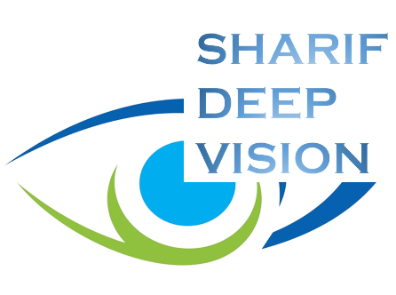

<div align="center"></div>

## Introduction
In this project, we intend to detect objects that are closer than a threshold using depth estimation and object detection networks.

We used the [AdaBins](https://github.com/Megvii-BaseDetection/YOLOX) for depth estimation and [YOLOX](https://github.com/shariqfarooq123/AdaBins) for object detection.

## Download Links
* You can download the pretrained models "AdaBins_nyu.pt" and "yolox_m.pt" from [here](https://drive.google.com/drive/folders/1nYyaQXOBjNdUJDsmJpcRpu6oE55aQoLA?usp=sharing)

## Quick Start

* Step1. Clone the project.
```shell
git clone https://github.com/amindehnavi/DL2021_FinalProject.git
```

* Step2. Change current directory to "DL2021_FinalProject"

* Step3. Put "AdaBins_nyu.pt" in "./AdaBins/pretrained".
  
* Step4. Put "yolox_m.pt" in "./YOLOX/pretrained".
  
* Step5. Install the required packages.
```shell
pip3 install -r ./requirements.txt
```

* Step6. Run "GUI.py".
```shell
python ./GUI.py
```

## Cite US
If you use our report in your research, please cite us:

```latex
 @report{Sharif Deep Vision,
  title={DL2021 Final Project: Object Detection and Depth Estimation App},
  author={MohammadAmin RamezanDehnavi;ID:99202318, Sina Nabigol;ID:99205361},
  course={Deep Learning, Department of Electrical Engineering, Sharif University},
  year={2021}
}
```
